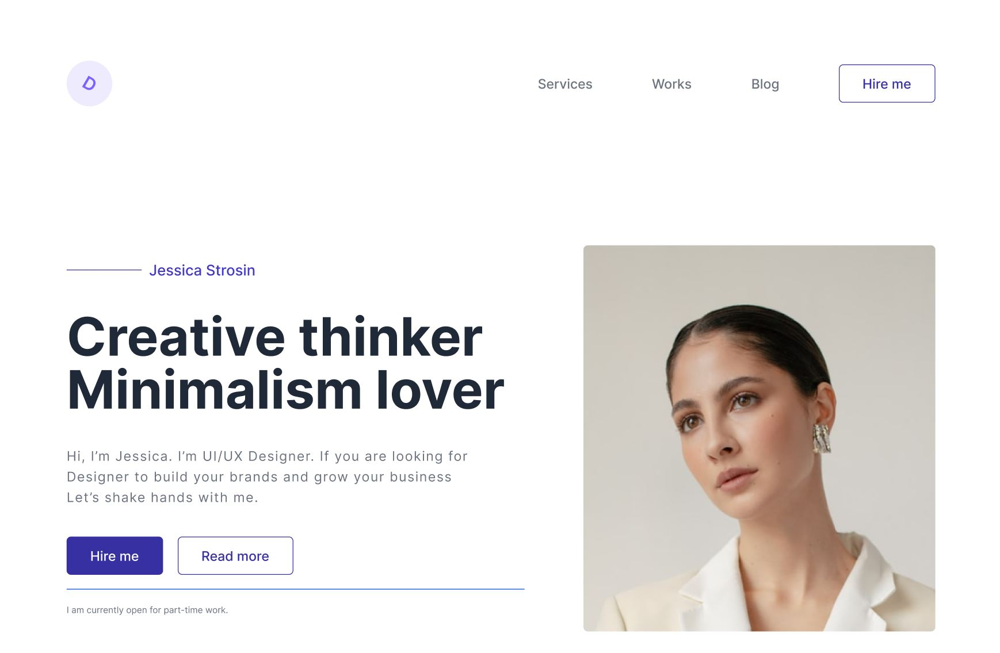

# tuto-css

## Integration complete d'une [maquette](https://www.figma.com/file/v18Y99mekvztIIQuhXs1ij/Portfolio-design?node-id=0%3A1&t=INyPmf4gT13Q6DIe-1)

# Chapitres

## Chapitre 1: Initialisation du projet
Utilisation de [Vite](https://vitejs.dev/): Outil de construction de projets qui améliore considérablement le développement 

## Chapitre 2: Navbar et Header
Intégration de la Navbar et du Header avec gestion des espacements

## Chapitre 3: Navbar et Header responsive
Adaptation automatique du positionnement des elements en fonction de la taille de l'ecran. Gestion du menu "Hamburger"

## Chapitre 4: Premiere section
Intégration de la première section en utilisant les grilles `display: grid` tout en gérant la responsive et le changement de position dans la grille

## Chapitre 5: Deuxième et troisième sections
Positionnement des premières images ( après exportation). Une autre façon d'utiliser les grilles est presentee `grid-template-area`

## Chapitre 6: Icon et Footer
Intégration du bas de page avec des liens de réseaux sociaux

# Bonus

## Chapitre 6: Apparition au défilement
Utilisation de l'API javascript `Intersection Observer` pour savoir quand un element devient visible dans la zone d'affichage puis l'animé avec un effet d'apparition

## Chapitre 6: Github, SEO et hébergement
Optimisation basique du SEO, envoi du projet sur Github et hébergement avec versel

# Utilitaires

## [Maquette](https://www.figma.com/file/v18Y99mekvztIIQuhXs1ij/Portfolio-design?node-id=0%3A1&t=INyPmf4gT13Q6DIe-1)
https://www.figma.com/file/v18Y99mekvztIIQuhXs1ij/Portfolio-design?node-id=0%3A1&t=INyPmf4gT13Q6DIe-1

## [Site](https://tuto-css.vercel.app/)
https://tuto-css.vercel.app/

